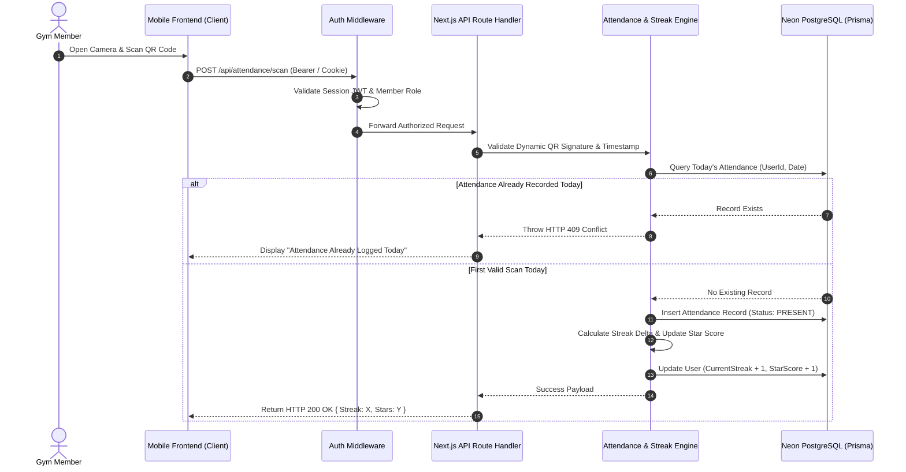

# 01. High-Level System Architecture

This document defines the high-level system topology, client/server boundaries, component interactions, and overall runtime environment for the Gym Management Application.

---

## 1. System Topology & Ecosystem

The system follows a modern serverless full-stack web architecture utilizing Next.js (App Router) deployed on Vercel, connected to Neon PostgreSQL database via Prisma ORM.

```mermaid
graph TD
    subgraph Client Tier
        MB[Mobile Browser / PWA Member]
        AB[Desktop Browser Admin]
        QRD[Gym Front Desk QR Display Monitor]
    end

    subgraph Edge & API Tier (Next.js App Router)
        CDN[Vercel Edge Network / CDN]
        MW[Next.js Auth & RBAC Middleware]
        RSC[React Server Components - UI Rendering]
        API[Next.js API Route Handlers / Server Actions]
    end

    subgraph Business Logic & Engines
        AUTH_ENG[Authentication Engine]
        ATT_ENG[Attendance & QR Verification Engine]
        STRK_ENG[Streak & Star Calculation Engine]
        PAY_ENG[Razorpay Payment & Webhook Verification]
        INACT_ENG[10-Day Inactivity Cron Engine]
    end

    subgraph Database & Persistence Tier
        PRISMA[Prisma ORM]
        POOL[Neon Database Connection Pooler]
        NEON[(Neon Serverless PostgreSQL)]
    end

    subgraph External Services Tier
        RZP[Razorpay Payment Gateway API]
        FCM[Firebase Cloud Messaging FCM]
        CLD[Cloudinary / S3 Image Storage]
    end

    %% Client Interactions
    MB -->|HTTPS / WSS| CDN
    AB -->|HTTPS| CDN
    QRD -->|Fetch Dynamic QR Payload| API

    %% Edge Ingress
    CDN --> MW
    MW --> RSC
    MW --> API

    %% Logic Routing
    API --> AUTH_ENG
    API --> ATT_ENG
    API --> STRK_ENG
    API --> PAY_ENG
    API --> INACT_ENG

    %% Persistence Flow
    AUTH_ENG --> PRISMA
    ATT_ENG --> PRISMA
    STRK_ENG --> PRISMA
    PAY_ENG --> PRISMA
    INACT_ENG --> PRISMA

    PRISMA --> POOL
    POOL --> NEON

    %% External Connections
    PAY_ENG <--> RZP
    INACT_ENG --> FCM
    API --> CLD
```

---

## 2. Frontend Layer Architecture (Next.js App Router)

The frontend is structured using Next.js App Router with TypeScript and Tailwind CSS, leveraging React Server Components (RSC) for maximum performance and minimal client bundle size.

### 2.1 Directory & Layout Separation
- `app/(auth)/`: Login and QR Registration onboarding routes.
- `app/(user)/`: Member Portal routes (`/user/dashboard`, `/user/attendance`, `/user/membership`, `/user/diet`, `/user/store`, `/user/community`).
- `app/(admin)/`: Executive Admin routes (`/admin/dashboard`, `/admin/members`, `/admin/attendance`, `/admin/plans`, `/admin/diets`, `/admin/products`).
- `app/api/`: RESTful API route handlers for mobile check-ins, payment webhooks, cron jobs, and data mutation.

### 2.2 Server Components vs. Client Components
- **React Server Components (RSC)**: Used by default for rendering member dashboards, admin analytics views, diet plan details, and product catalogs. RSC fetches data directly from Neon PostgreSQL via Prisma on the server, eliminating client-side fetch waterfalls.
- **Client Components (`'use client'`)**: Restricted strictly to interactive elements:
  - Mobile QR Camera Scanner (`/user/attendance`)
  - Dynamic QR Display Loop (`/admin/qr-display`)
  - Razorpay Checkout Modal Invocation
  - Interactive Filter Tabs & Forms

---

## 3. Backend Layer Architecture (Next.js API & Server Actions)

The backend operates entirely within the Next.js runtime, providing stateless execution across API Route Handlers and Server Actions.


