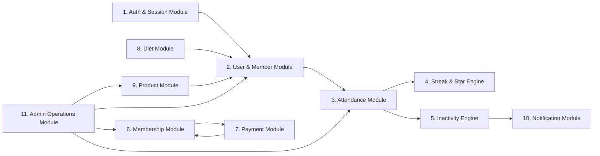

# 02. Subsystem & Module Architecture

This document details the functional decomposition of the Gym Management Application into discrete, loosely coupled software modules.

---

## 1. Module Overview & Dependencies

---

## 2. Detailed Module Specifications

### 2.1 Authentication & Session Module (`AUTH`)
- **Responsibilities**: User account registration via QR, password hashing, JWT session token generation, cookie serialization, role verification middleware (`MEMBER`, `ADMIN`).
- **Interfaces**:
  - `POST /api/auth/register`: Public registration endpoint (`AUTH-001`).
  - `POST /api/auth/login`: Credential authentication (`AUTH-002`).
  - `POST /api/auth/logout`: Session cookie revocation.
- **Dependencies**: Neon PostgreSQL (`User` table), Bcrypt.

### 2.2 User & Member Profile Module (`USER`)
- **Responsibilities**: Manages member demographics, profile avatars, fitness goals, and privacy-sanitized community leaderboards.
- **Interfaces**:
  - `GET /api/user/profile`: Returns authenticated user details (`USER-001`).
  - `GET /api/user/community`: Returns sanitized member list (`FirstName`, `LastNameInitial`, `Streak`) (`MEMBER-001`).
- **Dependencies**: Auth Module, Cloudinary/S3 Storage.

### 2.3 Attendance Module (`ATT`)
- **Responsibilities**: Handles QR payload decoding, HMAC-SHA256 signature verification, timezone-locked single daily attendance validation, and manual admin attendance overrides.
- **Interfaces**:
  - `POST /api/attendance/scan`: Mobile check-in verification (`ATT-001`).
  - `GET /api/attendance/history`: Monthly calendar attendance history (`ATT-002`).
  - `POST /api/admin/attendance/override`: Manual admin override (`ATT-003`).
- **Dependencies**: Auth Module, Streak Engine, Sunday Closure Service.

### 2.4 Streak & Performance Star Engine (`STREAK`)
- **Responsibilities**: Encapsulates consecutive day streak calculation logic, Sunday exclusion rules, and Star score deltas (+1 for present, -2 for missed eligible days).
- **Interfaces**:
  - `StreakEngine.recalculate(userId, eventDate, status)`: Internal domain service.
- **Dependencies**: Attendance Module.

### 2.5 Inactivity Detection Engine (`INACT`)
- **Responsibilities**: Daily cron service inspecting active member attendance histories, counting consecutive missed eligible gym days (excluding Sundays), and emitting 10-day inactivity notifications.
- **Interfaces**:
  - `POST /api/cron/inactivity-check`: Scheduled Vercel Cron execution (`NOTIFICATION-001`).
- **Dependencies**: Attendance Module, Notification Module.

### 2.6 Membership & Subscription Module (`MEM`)
- **Responsibilities**: Admin membership plan creation (CRUD), subscription lifecycle transitions (`PENDING`, `ACTIVE`, `EXPIRING_SOON`, `EXPIRED`), end-date expiry lockouts.
- **Interfaces**:
  - `GET /api/memberships/plans`: Active plan catalog (`MEMBERSHIP-001`).
  - `POST /api/admin/memberships/plans`: Admin plan creation.
- **Dependencies**: Payment Module, Auth Module.

### 2.7 Payment & Webhook Verification Module (`PAY`)
- **Responsibilities**: Razorpay order creation, client checkout initialization, server-side HMAC signature validation, asynchronous webhook processing (`payment.captured`), payment history logging.
- **Interfaces**:
  - `POST /api/payments/create-order`: Initiates Razorpay Order (`PAYMENT-001`).
  - `POST /api/payments/verify`: Cryptographic signature verification.
  - `POST /api/webhooks/razorpay`: Async payment webhook listener (`BR-PAY-001`).
- **Dependencies**: Razorpay REST API, Membership Module.

### 2.8 Diet & Nutrition Module (`DIET`)
- **Responsibilities**: Admin creation of meal templates and macro targets (Calories, Protein, Carbs, Fats), assignment to members, and member meal view.
- **Interfaces**:
  - `GET /api/user/diet`: Member assigned diet plan (`DIET-002`).
  - `POST /api/admin/diets`: Admin diet template creation (`DIET-001`).

### 2.9 Product & Store Inventory Module (`PRODUCT`)
- **Responsibilities**: Product catalog management (pricing, stock, image upload), stock decrement handling, member product requests/purchases.
- **Interfaces**:
  - `GET /api/products`: Member storefront catalog (`PRODUCT-002`).
  - `POST /api/admin/products`: Admin inventory management (`PRODUCT-001`).

### 2.10 Admin Operations & Analytics Module (`ADMIN`)
- **Responsibilities**: Aggregates macro KPIs (Total Members, Active/Inactive Ratio, Today's Attendance Count, Revenue Metrics, Pending Orders) and provides member profile lookup drawers.
- **Interfaces**:
  - `GET /api/admin/dashboard/stats`: Real-time KPI aggregate query (`ADMIN-001`).
  - `GET /api/admin/members`: Searchable member directory (`ADMIN-002`).
