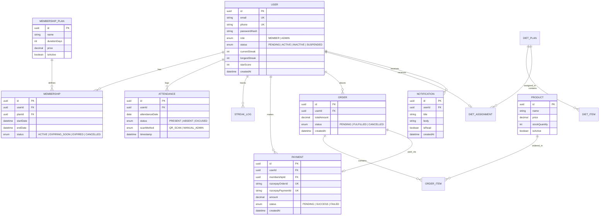

# 03. Database Architecture & Persistence Layer

This document specifies the Neon PostgreSQL database architecture, Prisma ORM configuration, connection pooling strategy, entity-relationship model, and index optimizations.

---

## 1. Database Infrastructure (Neon PostgreSQL)

- **Database Engine**: Neon Serverless PostgreSQL 16+
- **Connection Management**: Neon Serverless Connection Pooling (`@neondatabase/serverless` / Prisma Accelerate)
- **Timezone Setting**: UTC database storage; business day boundaries resolved using Gym Local Timezone (`Asia/Kolkata`).
- **Migration Strategy**: Prisma Migrate (`npx prisma migrate dev` / `npx prisma migrate deploy`).

---

## 2. Entity-Relationship Overview

---

## 3. High-Performance Indexing Strategy

To maintain target latencies ($\le 500 \text{ ms}$ check-in, $\le 50 \text{ ms}$ DB queries) under high concurrency, the following composite indexes and unique constraints are defined:

1. **Attendance Single Scan & Fast Lookup**:
   - `CREATE UNIQUE INDEX "idx_attendance_user_date" ON "Attendance" ("userId", "attendanceDate");`
   - *Purpose*: Guarantees single check-in per user per day at database level and eliminates race conditions.

2. **Daily Attendance Range & Streak Queries**:
   - `CREATE INDEX "idx_attendance_date_status" ON "Attendance" ("attendanceDate", "status");`
   - *Purpose*: Optimizes daily attendance counter and 10-day inactivity cron scanner.

3. **Active Membership Lookup**:
   - `CREATE INDEX "idx_membership_user_status_dates" ON "Membership" ("userId", "status", "startDate", "endDate");`
   - *Purpose*: Accelerates attendance pre-check authorization.

4. **Razorpay Payment Verification Lookup**:
   - `CREATE UNIQUE INDEX "idx_payment_razorpay_order" ON "Payment" ("razorpayOrderId");`
   - *Purpose*: Speeds up signature verification and webhook idempotency checks.
