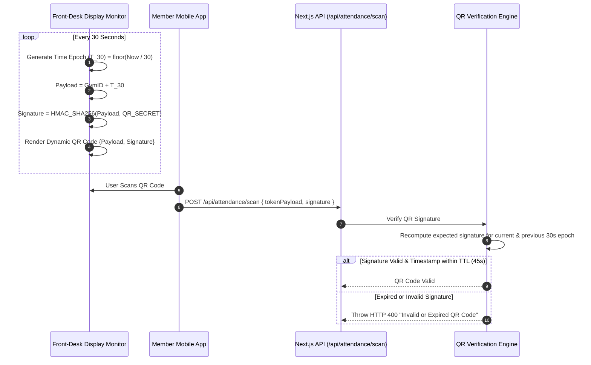
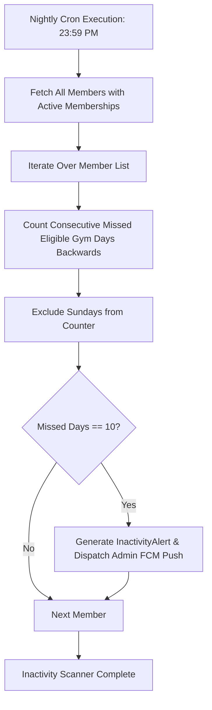

# 04. Cryptographic QR, Attendance & Streak Engine Architecture

This document details the dynamic QR verification mechanics, single check-in transaction locking, Sunday-safe streak calculation engine, and star score algorithms.

---

## 1. Dynamic QR Code Security Engine

To prevent attendance proxy fraud (members taking photos of QR codes and sharing them remotely), the system implements a dynamic time-decaying HMAC-SHA256 token payload on the gym front-desk display.



---

## 2. Sunday-Safe Streak Calculation Engine

### 2.1 Sunday Logic Formal Definition
The streak engine explicitly enforces `BR-SUNDAY-001`. Sunday is treated as a non-evaluating day that preserves existing streaks without incrementing or decrementing them.

```mermaid
flowchart TD
    Start[New Attendance or Batch Evaluation] --> GetDay{What Day is Today?}
    GetDay -- Sunday --> SundaySkip[Sunday Gym Holiday: No Streak Action / Retain Current Streak]
    GetDay -- Mon-Sat Eligible Day --> CheckAttendance{Did Member Attend Today?}
    
    CheckAttendance -- Yes --> IncrementStreak[CurrentStreak = CurrentStreak + 1<br>StarScore = StarScore + 1]
    CheckAttendance -- No --> MissedCheck{Was Member Absent?}
    
    MissedCheck -- Yes --> ResetStreak[CurrentStreak = 0<br>StarScore = max(0, StarScore - 2)]
    
    IncrementStreak --> UpdateLongest{CurrentStreak > LongestStreak?}
    UpdateLongest -- Yes --> SetLongest[LongestStreak = CurrentStreak]
    UpdateLongest -- No --> SaveDB[Persist User Metrics to DB]
    SetLongest --> SaveDB
    ResetStreak --> SaveDB
    SundaySkip --> End[End Engine Execution]
    SaveDB --> End
```

### 2.2 Streak Sequence Validation Examples

| Date | Day | Attendance Status | Streak Delta | Current Streak | Star Delta | Star Score | Notes |
| :--- | :--- | :--- | :---: | :---: | :---: | :---: | :--- |
| **Oct 02** | Friday | `PRESENT` | $+1$ | **1** | $+1$ | **1** | Initial attendance |
| **Oct 03** | Saturday | `PRESENT` | $+1$ | **2** | $+1$ | **2** | Consecutive weekday |
| **Oct 04** | Sunday | `HOLIDAY` | $0$ | **2** | $0$ | **2** | **Sunday: Zero effect, streak preserved** |
| **Oct 05** | Monday | `PRESENT` | $+1$ | **3** | $+1$ | **3** | Streak correctly resumes at 3 |
| **Oct 06** | Tuesday | `ABSENT` | Reset | **0** | $-2$ | **1** | Missed eligible day: Streak resets to 0 |

---

## 3. Automated 10-Day Inactivity Scanner

The inactivity detection engine executes nightly at 23:59 PM (Gym Local Timezone).


