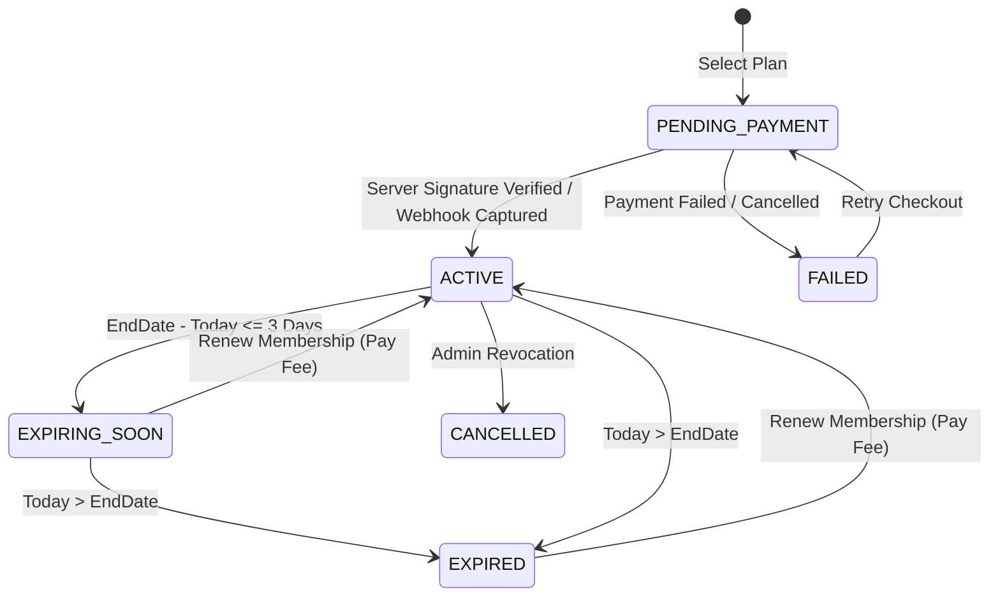
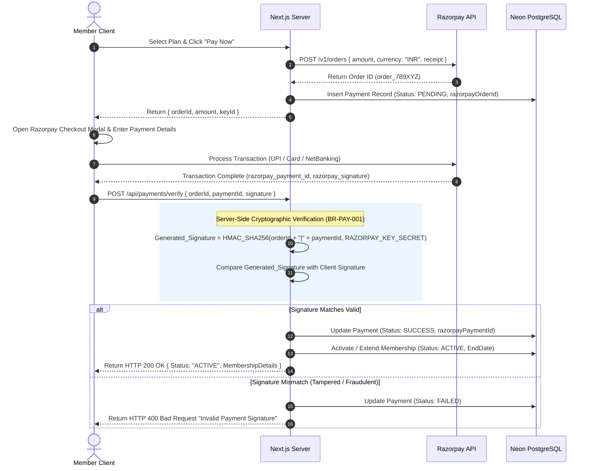

# 05. Payment & Membership Architecture

This document details the integration architecture with Razorpay Payment Gateway, membership subscription state transitions, server-side signature verification, and webhook resilience.

---

## 1. Subscription State Machine

A member subscription transitions through explicit lifecycle states:

---

## 2. Razorpay Payment & Verification Flow

---

## 3. Webhook Handling (`payment.captured`)

To handle edge cases where the user closes their browser window before client verification finishes (`EC-PAY-001`), an asynchronous Razorpay Webhook listener is exposed at `/api/webhooks/razorpay`.

1. **Header Verification**: Validates `X-Razorpay-Signature` header using `RAZORPAY_WEBHOOK_SECRET`.
2. **Idempotency Execution**: Checks if payment record for `orderId` is already marked `SUCCESS`. If already processed, return `HTTP 200 OK` immediately.
3. **Async State Update**: Updates payment status to `SUCCESS` and updates `Membership` start and end dates.
