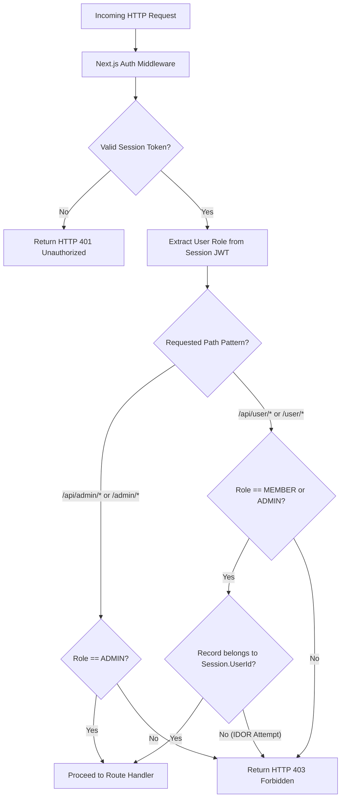

# 07. Security, RBAC & Data Privacy Architecture

This document defines the application's defense-in-depth security model, authentication flows, authorization middleware, input sanitization, dynamic QR anti-replay engines, and data privacy safeguards.

---

## 1. Authentication & Session Architecture

- **Session Handling**: JWT (JSON Web Tokens) encapsulated in secure, `HTTP-Only`, `SameSite=Lax`, `Secure` cookies. This mitigates Cross-Site Scripting (XSS) token exfiltration risks.
- **Token Expiry**: Short-lived Access Tokens (1 hour TTL) paired with Refresh Tokens (7 days TTL) stored securely in Neon PostgreSQL.
- **Password Security**: Passwords hashed using `bcrypt` / `Argon2id` with salt rounds $\ge 12$. Plaintext passwords are never stored or logged.

---

## 2. Role-Based Access Control (RBAC) Architecture

---

## 3. Threat Matrix & Defense Controls

| Security Risk | Attack Vector | Technical Defense Mechanism |
| :--- | :--- | :--- |
| **Attendance Proxy Fraud** | User screenshots attendance QR code and sends to absent friend | Dynamic QR code refreshed every 30s with HMAC signature + 45s server TTL verification (`BR-QR-002`). |
| **Forged Payment Callbacks** | Malicious user posts fake `payment.success` payload to backend | Strict server-side HMAC-SHA256 signature verification using Razorpay secret (`BR-PAY-001`). |
| **SQL Injection** | Malicious SQL inputs in login or search inputs | 100% Prisma ORM parameterized query execution; raw SQL queries prohibited. |
| **Cross-Site Scripting (XSS)** | Injection of scripts in profile fields or product names | React automatic string escaping + Zod input sanitization. |
| **Direct Object Reference (IDOR)**| Member changes `userId` parameter in URL to read peer profile/payments | API data projection scoped strictly to `WHERE userId = Session.UserId`. |
| **Brute Force Scans / Auth** | Automated bot scanning `/api/attendance/scan` or login | Upstash Redis / Next.js Rate Limiter (max 10 scan attempts/minute per IP). |
| **PII Data Leak in Community** | Exposing email/phone numbers in community API responses | API serializers strictly output sanitized fields (`FirstName`, `LastNameInitial`, `Streak`) (`BR-PRIVACY-001`). |
