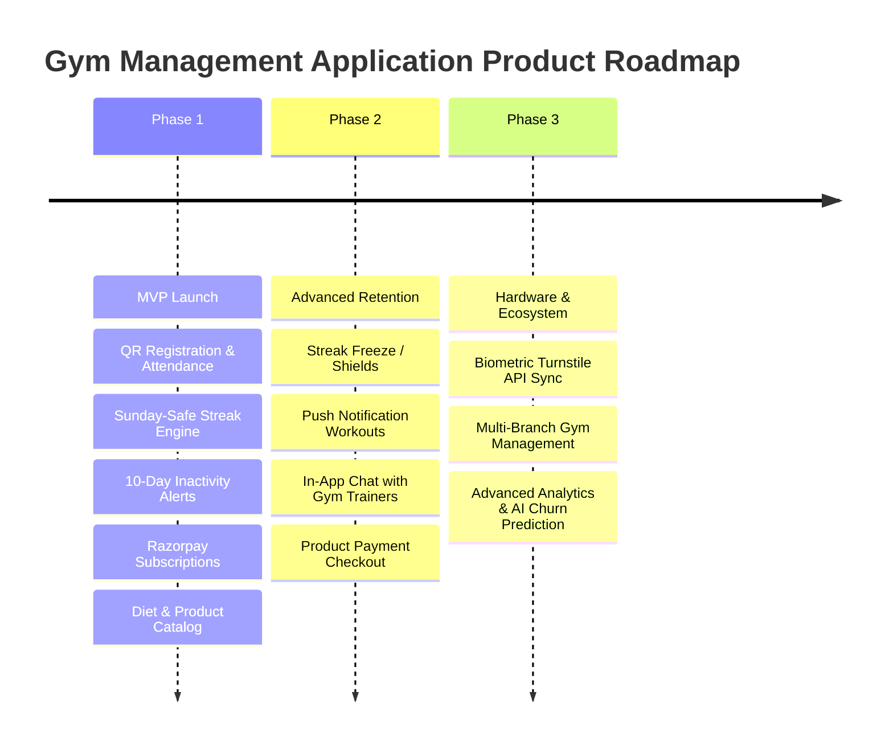

# 09. Scope & Roadmap Boundaries

This document defines the explicit MVP functional scope, explicitly excluded items (Out of Scope), foundational assumptions, external dependencies, and future enhancement roadmap.

---

## 1. MVP In-Scope Requirements

| Module | Summary of Included Capabilities | Key Requirement IDs |
| :--- | :--- | :--- |
| **Authentication & Onboarding** | QR-based self-registration, credential login, role-based session routing (Member / Admin). | `AUTH-001`, `AUTH-002` |
| **Attendance & QR System** | Dynamic/static attendance QR scanning, backend single-scan lock, Sunday closure logic, manual admin override. | `ATT-001`, `ATT-002`, `ATT-003` |
| **Streak & Star Engine** | Consecutive eligible day streak engine, Sunday preservation rule, +1/-2 star calculation. | `STREAK-001`, `STREAK-002` |
| **Inactivity Alerts** | Automated 10-day consecutive inactivity detection (excluding Sundays) with admin alerts. | `NOTIFICATION-001` |
| **Membership Management** | Plan creation (CRUD), subscription tracking, status transitions (`ACTIVE`, `EXPIRING_SOON`, `EXPIRED`). | `MEMBERSHIP-001`, `MEMBERSHIP-002` |
| **Payment Gateway** | Online membership purchase/renewal via Razorpay with mandatory server-side signature verification. | `PAYMENT-001`, `PAYMENT-002` |
| **Diet Management** | Admin template creation and assignment; member meal plan viewer. | `DIET-001`, `DIET-002` |
| **Product Management** | Product catalog management (price, stock, images), member store view, stock decrement on request. | `PRODUCT-001`, `PRODUCT-002` |
| **Admin Operations** | Dashboard analytics (active/inactive counts, today's check-ins, revenue), full member list inspection. | `ADMIN-001`, `ADMIN-002` |
| **Member Community** | Privacy-preserved member leaderboard (Name, Profile Pic, Current Streak). | `MEMBER-001` |

---

## 2. Explicitly Out-of-Scope (MVP Release)

The following capabilities are **EXCLUDED** from the initial MVP release to maintain lean architectural scope:
1. **Biometric / Hardware Turnstile Integration**: No direct integration with physical hardware gate turnstiles or facial recognition devices. Attendance is strictly QR-code based.
2. **Personal Trainer Booking & Scheduling**: No trainer appointment slot booking or 1-on-1 session scheduling.
3. **Advanced Financial Accounting**: No tax calculation engines, GST multi-tier invoicing, or external accounting platform synchronization (e.g. Tally / QuickBooks).
4. **Custom Workout Builder with Video Streaming**: No native video hosting or animated exercise library player. Workout details are text/image-based.
5. **Multi-Gym Branch / Franchise Tenant Routing**: Scope assumes single gym entity deployment (unless `OBD-NFR-001` is resolved as multi-tenant).

---

## 3. Foundational Project Assumptions

1. **Hardware Availability**: The gym premises will feature a dedicated display screen / tablet at the front desk to render the dynamic Attendance QR code, or will mount a secure physical QR code poster.
2. **Network Connectivity**: Gym members possess smartphones with active mobile data or access gym Wi-Fi to execute QR attendance scans.
3. **Gym Schedule**: The gym operates 6 days a week (Monday through Saturday) and is closed every Sunday.
4. **Timezone Uniformity**: All attendance timestamps, daily streak batch jobs, and inactivity evaluations are anchored to the local timezone of the gym location (e.g., Asia/Kolkata).

---

## 4. External Technical Dependencies

1. **Neon PostgreSQL**: Cloud database server availability and connection pooling readiness.
2. **Razorpay API**: Operational merchant API keys (`RAZORPAY_KEY_ID`, `RAZORPAY_KEY_SECRET`) for payment processing and webhook delivery.
3. **Firebase Cloud Messaging (FCM)**: Push notification service configuration for background web/mobile push alerts.
4. **Cloudinary / AWS S3**: Object storage bucket configuration for user avatar images and product catalog photos.

---

## 5. Future Phase Roadmap

